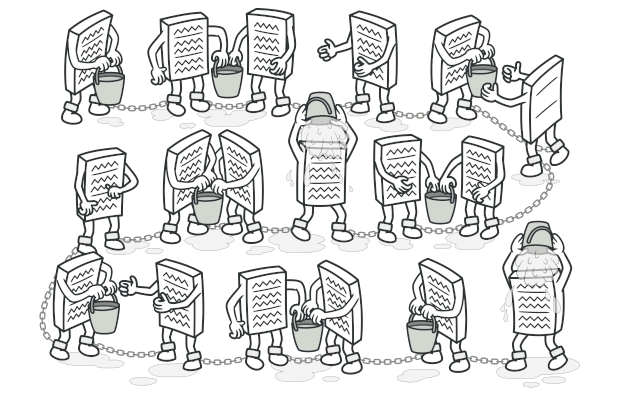

#  Design Patterns into Functional Programming

This repository contains some examples OOP design patterns. In this dojo we will change them in a more functional way using functional interfaces available on [java.util.function package](https://docs.oracle.com/javase/8/docs/api/java/util/function/package-summary.html).

## Overview of Functional Interfaces
A functional interface in Java is an interface with a single abstract (unimplemented) method. It can also contain default and static methods with implementations. Here is a simple example:

```java
public interface MyFunctionalInterface {
    void execute();
}
```

Functional interfaces can be implemented using lambda expressions, providing a concise way to express instances of single-method interfaces.

Example with Default and Static Methods
Functional interfaces can include default and static methods, as shown below:

```java
public interface MyFunctionalInterface2 {
    void execute();

    default void print(String text) {
        System.out.println(text);
    }

    static void print(String text, PrintWriter writer) throws IOException {
        writer.write(text);
    }
}
```
### Lambda Expressions 
Functional interfaces can be implemented with lambda expressions:

```java
MyFunctionalInterface lambda = () -> {
        System.out.println("Lambda execution!");
};
```
### Built-in Functional Interfaces
Java provides several built-in functional interfaces for common use cases:

### Function
The Function<T,R> interface represents a function that takes a single parameter and returns a value.

```java
public interface Function<T, R> {
    R apply(T parameter);
}
```
Example using a class:

```java
public class CalculatePremium implements Function<Double, Double> {
    @Override
    public Double apply(Double propertyValue) {
        return propertyValue * 0.005;
    }
}
```
Example using a lambda expression:

```java
Function<Double, Double> calculatePremium = propertyValue -> 
        propertyValue * 0.005;
```
### Predicate
The Predicate<T> interface represents a function that takes a single parameter and returns a boolean.

```java
public interface Predicate<T> {
    boolean test(T t);
}
```

Example using a class:

```java
public class CheckDiscountEligibility implements Predicate<Property> {
    @Override
    public boolean test(Property property) {
        return property.hasSmokeDetectors() && property.hasSecuritySystem();
    }
}
```

Example using a lambda expression:

```java
Predicate<Property> isEligibleForDiscount = property ->
        property.hasSmokeDetectors() && property.hasSecuritySystem();
```

### UnaryOperator
The UnaryOperator<T> interface represents an operation on a single operand that produces a result of the same type.

```java
UnaryOperator<Claim> updateClaimStatus = claim -> {
        claim.setStatus("Processed");
        return claim;
};
```
### BinaryOperator
The BinaryOperator<T> interface represents an operation upon two operands of the same type, producing a result of the same type.

```java
BinaryOperator<Claim> combineClaims = (claim1, claim2) -> {
        claim1.setAmount(claim1.getAmount() + claim2.getAmount());
        return claim1;
};
```

### Supplier
The Supplier<T> interface represents a supplier of results.

```java
Supplier<Integer> supplier = () -> new Integer((int) (Math.random() * 1000D));
```
### Consumer
The Consumer<T> interface represents an operation that accepts a single input argument and returns no result.

```java
Consumer<Claim> approveClaim = claim -> {
        claim.setApproved(true);
        System.out.println("Claim approved: " + claim);
};
```

## Overview of Design Patterns

### Strategy Design Pattern:


Strategy is a behavioral design pattern that lets you define a family of algorithms, put each of them into a separate class, and make their objects interchangeable.

### Decorator Design Pattern:


Decorator is a structural design pattern that lets you attach new behaviors to objects by placing these objects inside special wrapper objects that contain the behaviors.

### Chain of Responsability Design Pattern:


Chain of Responsibility is a behavioral design pattern that lets you pass requests along a chain of handlers. Upon receiving a request, each handler decides either to process the request or to pass it to the next handler in the chain.

### Factory Design Pattern:


Factory Method is a creational design pattern that provides an interface for creating objects in a superclass, but allows subclasses to alter the type of objects that will be created.

## Design patters UML Diagrams:

### Strategy Design Pattern:


### Decorator Design Pattern:


### Chain of Responsability Design Pattern:


### Factory Design Pattern:


## Important concepts:
* Single Abstract Method (SAM) type
    * another name for `@FunctionalInterfaces`
        * functional interface is also known as Single Abstract Method Interface
    * example: `Runnable`, `Callable`, etc
    * provide target types for lambda expressions and method references
* first-class citizen
    * is an entity which supports all the operations generally available to other entities
    * operations typically include being passed as an argument, returned from a function, modified, and
      assigned to a variable

## Mapping
Pattern                 | Lambda
----------------------- | --------------
Chain of Responsibility | Stream of functions
Decorator               | Functions composition
Strategy                | Enum
Factory                 | Enum

## References
* [OOP v̶s̶ and FP by Mario Fusco](https://www.youtube.com/watch?v=p6cZO5V2ehw)
* [g ∘ f patterns by Mario Fusco](https://www.youtube.com/watch?v=Rmer37g9AZM)
* https://github.com/mariofusco/from-gof-to-lambda
* https://en.wikipedia.org/wiki/First-class_citizen
* https://en.wikipedia.org/wiki/First-class_function
* https://www.quora.com/What-is-a-Single-Abstract-Method-SAM-interface-in-Java-8